# 从源码构建一个最小 Linux 系统

本文基于WSL2，Debian13发行版。

严格来说，Linux 只是操作系统内核。本文会先从源码编译并运行 Linux 内核，再逐步补上 init 进程、initramfs、glibc、BusyBox 等用户态组件，最终得到一个可以交互使用的最小 Linux 系统。

## 环境准备

### WSL配置

请确保您使用了Windows11或Windows10的较高版本，以保证对WSL2有完善的支持。

```powershell
wsl --install Debian
```

在本文编写时（2026-05-17），该命令会下载Debian 13版本。若很久后Debian出更高版本，整体流程应该不会有本质差异，但部分软件版本、包名或默认配置可能需要按实际环境调整。

#### 清理PATH环境变量

默认的WSL会继承Windows的PATH环境变量，这本意是让用户在WSL环境下也可以轻松执行Windows内的命令行工具，但也会影响路径搜索，为避免该问题，需要禁止WSL继承Windows PATH。

使用任意文本编辑器以root权限编辑`/etc/wsl.conf`，在下方追加：

```
[interop]
appendWindowsPath = false
```

追加后，回到Windows环境，使用`wsl --shutdown`关闭当前Linux，重新进入。

```powershell
wsl --shutdown
wsl
```


#### Debian换源

对于国内Linux用户，访问Debian官方源可能会很慢，推荐使用[清华源](https://mirrors.tuna.tsinghua.edu.cn/help/debian/)。换源方法在此不过多赘述，但需要注意的是，Debian13使用了新的DEB822格式，若使用传统方式（即编辑`/etc/apt/sources.list`）换源，需要再执行以下命令，避免原有的Debian源卡住`apt update`。

```bash
sudo mv /etc/apt/sources.list.d/0000debian.sources \
/etc/apt/sources.list.d/0000debian.sources.bak
```

## 源码下载

可以去内核归档网站([kernel.org](https://kernel.org)) 下载内核源代码。本文使用的是 `linux-7.0.8`，读者也可以选择相近版本的内核；如果版本跨度较大，少量配置项名称或默认值可能会变化。进入网站后，点击下载你想要版本的 tarball 即可。

> [!IMPORTANT]
>
> 通常，在Windows的终端中输入`wsl`会进入当前所在的Windows目录，**强烈不建议**在该目录内进行内核编译等操作，这会严重拖慢编译速度。应该先使用`cd`命令跳转到Linux内的用户根目录。

下载后，将内核的tar文件复制到Linux的用户目录下。

```bash
sudo apt install xz-utils -y
tar -xf linux-7.0.8.tar.xz
cd linux-7.0.8
```

解压完Linux后，我们需要准备编译必备的环境。

## 构建并执行第一个Linux内核

### 环境准备

Linux内核也是在Linux上完成编译的，编译Linux内核需要许多工具，本文仅会安装编译Linux所需的最少工具。

工具列表：

- `make & gcc` 核心构建工具，包括构建脚本解释器和C语言编译器。
- `binutils` 汇编器、链接器、`objcopy`等二进制工具
- `flex & bison` 用于配置时期的代码生成
- `bc` 高精度计算器
- `libncurses-dev` 使用`make menuconfig`需要的终端界面库
- `libelf-dev` elf头文件支持

执行下面脚本安装必要依赖。

```bash
sudo apt install make gcc \
	binutils flex bison bc cpio libelf-dev lbzip2 bzip2 pkg-config \
	libncurses-dev -y
```

安装好环境，就可以开始内核配置了。

### 内核配置

使用`make tinyconfig`执行最小配置，这将会产生一个可以编译出最小可执行内核的配置。

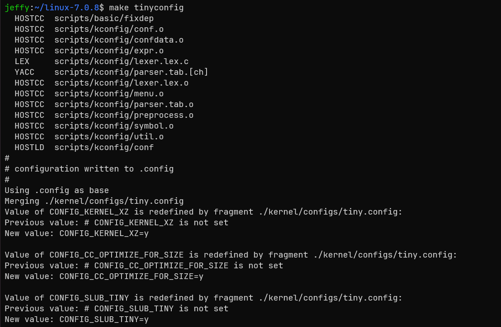

执行后，配置文件将会写入`.config`文件，可以使用`less .config`查看配置，可以看到，以`#`开头的是注释，大量功能默认没有启用，只有最基础的选项被配置为`y`。这里我们不过多纠结具体内容，只需要了解大体格式即可。

拥有`.config`文件后，就可以执行`make -j$(nproc)`来进行内核的编译了，稍微等待几分钟就会编译完成，此时我们就有了一个最小可运行的Linux内核了。不过现在的内核由于缺少一些驱动，还不能实际使用。

> [!note]
>
> 如果你的设备CPU核心数较多但可用内存较低，请不要使用`make -j$(nproc)`，编译时内存不足导致的频繁换页会严重拖慢速度，请根据实际情况将`$(nproc)`替换一个较小的数字。

编译出的内核文件有多个，在当前目录下有一个vmlinux，这是以ELF格式存放的Linux内核镜像，但我们实际使用的是存放于`arch/x86/boot/bzImage`中压缩后的Linux内核镜像。


### 运行内核

运行内核需要一个虚拟机，而Linux上调试内核最常见的虚拟机则是qemu，使用apt安装qemu-system，这可以让qemu模拟一台x86_64 PC。

```bash
sudo apt install qemu-system
```

安装需要一点时间，安装完成后，就可以使用qemu模拟器执行你的第一个Linux内核了。

```bash
qemu-system-x86_64 -kernel arch/x86/boot/bzImage -nographic
```

这里的`-kernel`指定了内核镜像，而`-nographic`则让qemu启动一个没有图形界面的电脑，我们现在还不需要图形界面。

运行后你会看到黑乎乎的一片，什么都没有。此时并不能直接从屏幕判断内核具体跑到了哪里，因为我们还没有把内核日志导向可见的控制台；但这也正好引出了下一步：让内核把启动过程打印出来。

> [!important]
>
> 按下Ctrl + A后，按X退出QEMU，推荐退出后再使用命令`reset`重置一下窗口内容，否则多行文本渲染可能有bug。

### 回忆一下计算机体系结构

如今我们的主流计算机大多可以按冯诺依曼结构理解，它由五个部分：运算器、控制器、存储器、输入设备和输出设备组成。在这个最简Linux内核中，QEMU模拟的机器当然仍然存在输入输出设备，但内核还没有启用可见的输出路径，也没有可交互的用户态程序。因此从我们的视角看，它只能默默执行启动流程，无法与用户交互。

## 逐步构建一个真正可用的内核

### 启用内核日志

在最初的内核里，我们什么也看不到，但我们希望至少内核可以告诉我们发生了什么，否则一片漆黑中，根本无法继续探索。

使用`make menuconfig`来进入文本菜单形式的Linux配置界面。


我们要启用几个关键选项：printk支持、TTY支持、串口驱动。

启用printk后，我们就可以看到内核的日志打印，这至少能让我们知道此时发生什么了。

```text
General setup  --->
  [*] Configure standard kernel features (expert users)  --->
    [*] Enable support for printk
```

启用TTY支持，让内核的printk输出到TTY终端，我们会在qemu的输出中看到内核的日志。

```text
Device Drivers  --->
  Character devices  --->
    [*] Enable TTY
  Serial drivers  --->
    [*] 8250/16550 and compatible serial support
    [*] Console on 8250/16550 and compatible serial port
```


重新编译，然后使用下面的命令执行内核。

```bash
qemu-system-x86_64 -kernel arch/x86/boot/bzImage -append "console=ttyS0" -nographic
```

这里的`-append`是内核的启动参数，通过使用该参数，内核将信息输出到console，而console的内容被导向ttyS0，而qemu中，ttyS0会被打印到标准输出中，此时就可以看到启动日志了。

> [!tip]
>
> `tty`：代表 Teletypewriter（电传打字机）。在计算机早期，人们使用电传打字机作为输入输出设备。虽然现在技术早就更新换代了，但 Linux 依然沿用了 `tty` 这个词来表示所有的**终端设备**。
>
> `S`：代表 **Serial**（串行）。这意味着它是一个串行通信接口。
>
> `0`：代表**编号**。在计算机世界里，计数通常从 0 开始。所以 `ttyS0` 是第一个串口（COM1），`ttyS1` 是第二个串口（COM2），以此类推。
>
> 如果不用`-nographic`参数，那么`-append "console=ttyS0"`也可以去掉。


可以看到，这次内核成功打印出了信息，在最后发生了内核panic：内核要找到一个初始化进程作为用户态的第一个进程（PID 1），它尝试寻找了`/sbin/init`，`/etc/init`，`/bin/init`，直到`/bin/sh`，都没有找到可运行的进程，不得已内核只能panic退出。


### 编写自己的init进程

Linux内核在启动完成后，就会启动系统中的第一个用户态进程，为PID1。对于这个从零开始构建的系统来说，它会成为其他用户态进程的祖先。作为这个特殊进程，它有几个特殊点。

1. 在普通系统启动流程中，它通常以root身份启动（但容器中的PID1并非如此）。
2. 没有被其他机制接管的孤儿进程通常会被托管给PID1；如果系统设置了subreaper，孤儿进程也可能先被对应的subreaper接管。
3. 一旦PID1崩溃或退出，内核会立刻panic，无法继续工作。

如今，几乎所有发行版都会使用`systemd`作为`init`进程，不过作为教程，本文会从头编写一个最简单的初始化进程。

在正式编写前，我们需要解决一些问题，以让我们的程序可以在自己的内核里正常工作。

#### 架构匹配：64位内核

在进入用户态之前，我们必须确保内核的位宽与我们即将编写的程序架构相匹配。默认情况下，编译器会编译出本平台的程序，在WSL2下，通常就是x86_64架构的程序。

```text
[*] 64-bit kernel
```

由于我们运行在现代的 x86_64 平台上，我们需要在内核选项里开启它。它决定了内核将运行在 64 位长模式（Long Mode）下，能够寻址超过 4GB 的内存，并使用 64 位的通用寄存器。如果关闭它，内核将编译为 32 位（i386）内核。

#### 运行核心：ELF支持

Linux 下绝大多数可执行程序、动态链接库和核心转储文件都是 **ELF（Executable and Linkable Format）** 格式。内核必须懂得如何解析这种格式，才能将编译好的程序加载到内存中执行。在最小配置下，内核并没有配置ELF的解析能力，需要我们手动配置。

```text
Executable file formats  --->
  [*] Kernel support for ELF binaries
```

如果缺少 ELF 支持，内核在尝试启动用户态程序时，会因为“无法识别的文件格式”而直接抛出 Exec format error。由于1号进程也无法执行，这会引起内核panic退出。

> [!tip]
>
> 虽然ELF是Linux世界的标准格式，但是Linux内核并不必须要求能解析ELF文件，也存在一些比ELF更简单的文件格式。

#### 动态链接与静态链接

在编写我们自己的 `init` 进程前，必须理解程序是如何运行的： 

* **动态链接（Dynamic Linking）**：程序在编译时并不包含库（如 glibc）的代码，而是在运行时依赖系统中的 `.so` 动态链接库。这种方式能节省硬盘和内存，但要求系统里必须有一套完整的动态链接加载器和基础库。
*  **静态链接（Static Linking）**：编译时把所有需要的库函数直接“打包”进最终的二进制文件中。生成的程序通常更大，但不依赖外部动态库和动态链接器，放到相同架构、兼容内核ABI的环境中就能运行。

由于我们现在这台设备上除了内核，什么库都没有，所以必须使用静态链接的方式编译，否则会因为缺少动态库与装载器而无法运行。

现在，我们创建一个目录`_root`，在其中新建一个`init.c`，写入如下内容。

```bash
mkdir -p _root
cd _root
```

```C [init.c]
#include <stdbool.h>
#include <unistd.h>
#include <string.h>
#include <stdio.h>

int main() {
    printf("init process started\n");
    while (true) {
        char buf[256] = {0};
        if (fgets(buf, sizeof(buf), stdin) == NULL) {
            printf("read error");
            return 1;
        }
        if (strcmp(buf, "exit\n") == 0) {
            return 2;
        }
        printf("You typed: %s", buf);
    }
}
```

使用如下命令编译。

```bash
gcc init.c -static -o init
```

其中，`-static`指的就是静态编译。可以使用`ldd`命令查看一个程序是否是静态链接程序。

```bash
jeffy:~/linux-7.0.8/_root$ ldd init
        not a dynamic executable
```

也可以使用`chroot`命令切换根，看看该程序是否可以在无库无加载器的情况下执行。

`chroot`全称是change root，它会让一个进程把指定目录当成新的根目录`/`。例如`sudo chroot . /init`会先把当前目录当成根目录，再在这个新根目录中执行`/init`。这样我们就可以在宿主Linux里模拟“系统里只有这个目录下的文件”的环境，用来检查程序是否真的不依赖外部动态库和动态加载器。

> [!NOTE]
>
> `chroot`命令需要特权才能执行。

```bash
jeffy:~/linux-7.0.8/_root$ sudo chroot . /init
init process started
aaa
You typed: aaa
bbb
You typed: bbb
exit
jeffy:~/linux-7.0.8/_root$
```


#### initramfs与cpio

现在我们的精简内核没有任何文件，即使编译出了自己的`init`进程，也无法塞到内核里，所以，我们需要启动Linux内核的`initramfs`功能。`initramfs`本质上是一个cpio归档，内核会在启动早期将它解包到内存中的rootfs里，无需提供实际的硬盘镜像。

```text
General setup  --->
  [*] Initial RAM filesystem and RAM disk (initramfs/initrd) support
```


在更新配置，重新编译内核后，我们要将我们的`init`文件打包为内核可识别的cpio文件格式。

```bash
cd _root
find | cpio -H newc -o > ../root.cpio
```

使用以下命令重新启动新编译的Linux内核。

```bash
cd ..
qemu-system-x86_64 -initrd root.cpio -kernel arch/x86/boot/bzImage -append "console=ttyS0" -nographic
```

`-initrd`为qemu的选项，该选项会将文件填入特定位置，Linux内核将会从该位置读取文件，并将initramfs解包到早期rootfs。

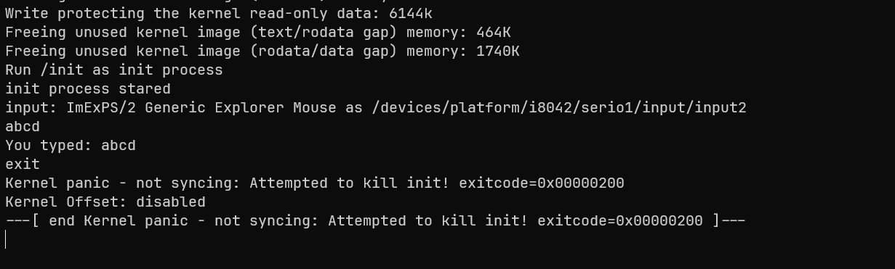

可以看到，当输入其他字符时，该程序会回显，而当输入exit时，程序会退出，而由于1号程序的退出，内核panic退出。

#### 原始系统调用与X86_64汇编

如果我们看我们自己写的`init`程序，会发现非常简单的一个功能，却占用了几百K的空间，这几百K的空间是静态链接的C库带来的，它为我们提供了C语言的大量功能，比如我们看到的`printf`、`fgets`、`strcmp`，以及对主函数返回值到退出码的支持。通过C库提供的这些包装，我们可以更轻松的和操作系统打交道。同时，C库也帮我们提供了屏蔽操作系统差异的接口，让我们可以把一套C语言程序移植到其他操作系统中。

然而在我们这个简易的init程序中，携带这么多代码就显得无用了，所以我们可以使用原始系统调用，避免对C库的依赖，以简化我们的可执行文件。

移除C库依赖的开始，我们需要移除对函数的依赖，`fgets`和`printf`显然不能再使用了，`strcmp`也不能直接用了，所以需要替换掉它们。

对于`strcmp`，我们可以轻松使用C语言自己实现。

```C
int strcmp(const char *s1, const char *s2) {
	while (*s1 && (*s1 == *s2)) {
		s1++;
		s2++;
	}
	return *(unsigned char *)s1 - *(unsigned char *)s2;
}
```

然而`printf`这样的函数涉及到向外部输出，我们就不得不和操作系统打交道了。`printf`是C库提供的打印函数，但如果直接和内核打交道，`printf`就无法使用了。

要想直接和内核打交道，就必须要了解**系统调用**。我们可以把系统调用看做一种特殊的函数调用，只不过函数调用调用的是自己写的函数或库，但系统调用要使用操作系统的能力。由于内核工作在更高的特权级，程序只能通过特定的指令来进行系统调用。在X86_64设备上，64位程序应使用`syscall`指令；`int 0x80`主要用于兼容旧的32位系统调用ABI，系统调用号和参数传递方式都不是本文使用的这套。

C语言为了保持跨平台兼容性，并不会原生提供系统调用的关键字，而是使用C库包装，所以为了使用原始系统调用，我们需要一些汇编来编写系统调用的核心代码。不过C语言为我们提供了内联汇编的能力，我们可以使用内联汇编来完成核心的功能，剩下的周边功能可以继续使用C语言。


```C [init.c]
#include <stdint.h>

#define STDIN 0
#define STDOUT 1

intptr_t syscall(intptr_t number, intptr_t arg1, intptr_t arg2, intptr_t arg3, intptr_t arg4, intptr_t arg5, intptr_t arg6) {
    intptr_t ret;
    register long r_num __asm__("rax") = number;
    register long r_a1  __asm__("rdi") = arg1;
    register long r_a2  __asm__("rsi") = arg2;
    register long r_a3  __asm__("rdx") = arg3;
    register long r_a4  __asm__("r10") = arg4;
    register long r_a5  __asm__("r8")  = arg5;
    register long r_a6  __asm__("r9")  = arg6;
	__asm__ volatile (
		"syscall\n\t"
		: "=a"(ret)
		: "r"(r_num), "r"(r_a1), "r"(r_a2), "r"(r_a3), "r"(r_a4), "r"(r_a5), "r"(r_a6)
		: "rcx", "r11", "memory"
	);
	return ret;
}

int strcmp(const char *s1, const char *s2) {
	while (*s1 && (*s1 == *s2)) {
		s1++;
		s2++;
	}
	return *(unsigned char *)s1 - *(unsigned char *)s2;
}

intptr_t read(int fd, void *buf, uintptr_t count) {
	return syscall(0, fd, (intptr_t)buf, count, 0, 0, 0);
}

intptr_t write(int fd, const void *buf, uintptr_t count) {
	return syscall(1, fd, (intptr_t)buf, count, 0, 0, 0);
}

__attribute__((noreturn)) void exit(int status) {
	(void)syscall(60, status, 0, 0, 0, 0, 0);
	__builtin_unreachable();
}

__attribute__((noreturn)) void start()
{

	write(STDOUT, "init process started\n", sizeof("init process started\n") - 1);
	while (1) {
		char buf[256] = { 0 };
		intptr_t readSize = read(STDIN, buf, sizeof(buf) - 1);
		if (readSize < 0) {
			write(STDOUT, "read error", sizeof("read error") - 1);
			exit(1);
		}
		if (strcmp(buf, "exit\n") == 0) {
			exit(2);
		}
		write(STDOUT, "You typed: ", sizeof("You typed: ") - 1);
		write(STDOUT, buf, readSize);
	}
}

__asm__(
".global _start\n"
"_start:\n\t"
	// 清空rbp
	"xorq %rbp, %rbp\n\t"
	// 16字节对齐rsp，避免SIMD指令引发的对齐SIGSEGV
	"andq $-16, %rsp\n\t"
	"movq %rsp, %rbp\n\t"
    "call start\n\t"
    "int $3\n"
);
```

使用以下命令编译，将会编译出一个仅有必要的核心内容的程序。它使用原始的系统调用直接完成功能，不带有额外的运行时开销。

```bash
gcc -fno-builtin -static -nostdlib -O2 init.c -o init
```

这样就可以编译出一个核心ELF，仅有9K。虽然命令里仍有`-static`，但由于同时使用了`-nostdlib`，最终不会链接libc；这里的`-static`只是避免生成需要动态链接器参与的程序。


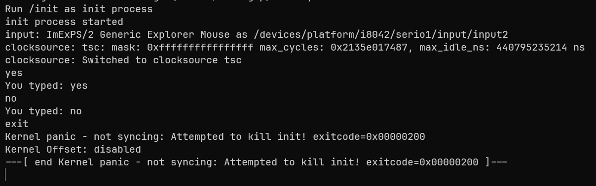

> 9K其实仍然有很多空位和可优化项，理论上可以把它优化到1K以内，不过本文主要讨论的点并非这里，所以此处略过。

## 构建可用的Linux操作系统

当然，一个只能回显输入的程序并不能体现出操作系统的功能。真实世界中，一个操作系统要实现各种各样的功能，除了需要硬件和内核的支持，也需要用户态程序的支持。严格来说，Linux 是内核；日常所说的 Linux 系统通常还包括 C 库、Shell、基础命令、init 系统等用户态组件。所以我们仍然需要构建核心的用户态周边，以求能够实现一个可用的 Linux 系统。

### glibc：Linux世界的基石

回忆一下我们静态链接的第一个`init`程序，为了使用`printf`等函数，我们不得不使用`-static`参数静态链接C库。事实上，大多数程序都会默认操作系统中存在一个C库实现，进而动态链接C库。并且不止C语言会使用，由于C库接口稳定，且针对常用功能做了大量优化，大多数语言的编译产物、解释型语言的解释器也会使用C库获得免费的性能提升。

> [!tip]
>
> 常见语言中，Golang是个例外：纯Go程序默认是静态链接的，不需要任何外部库的参与。

C库并非只有一种实现，常见的C库包括GNU的glibc、Android的Bionic libc、为静态链接设计的musl libc，微软也在Windows中提供了自己的C运行时实现，在Windows中是 `msvcrt.dll`。而我们这次要构建的是Linux世界中最通用的`glibc`。

前往[The GNU C Library](https://www.gnu.org/software/libc/#download)下载glibc的源码。本文使用的是 `glibc-2.43`，读者也可以替换为相近版本。通过这次构建，我们将会构建出C语言的核心库及头文件支持，为我们之后在自己的内核中运行用户态程序打下基础。与Linux内核不同，glibc并不会非常频繁地更新，也没有大量可配置的编译选项。这次编译会产生大量文件，而我们的核心目标文件有两个：`ld-linux`和`libc`。下载解压后，应该能看到图的目录结构。

这里为了降低复杂度，glibc会使用当前Debian环境提供的内核头文件完成构建。更严谨的rootfs构建流程通常会先准备目标内核的headers，再让glibc基于这些headers进行配置和编译。

> [!TIP]
>
> 你也可以前往[国内的镜像源](https://mirrors.hust.edu.cn/gnu/glibc/glibc-2.43.tar.xz)下载，避免网络问题。


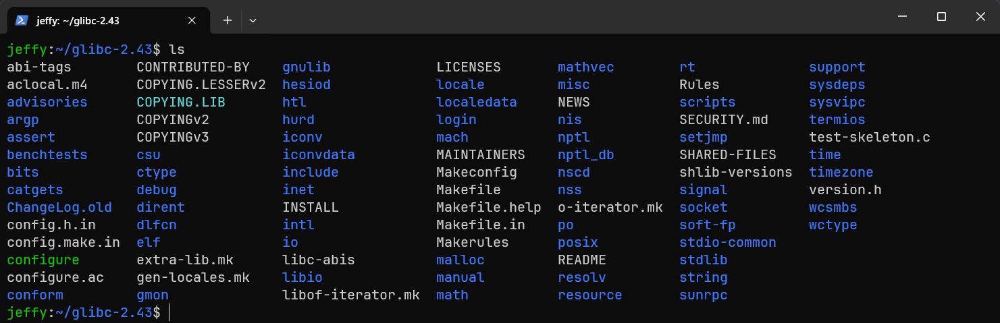

我们需要使用下面的命令构建libc。

```bash
# Debian自带的gawk可能有些老了
sudo apt update
sudo apt install gawk -y
# 创建构建目录，构建结果将会放在这里
mkdir build && cd $_
# 进行配置，由于我们要给自己的内核安装，所以prefix需要为根目录的 /usr
../configure --prefix=/usr
make -j$(nproc)
# 创建install目录
mkdir stage
# 构建，但不能真的把libc安装在/usr下，这会替换当前系统的libc，导致无法运行。
# 所以必须使用DESTDIR=$(realpath stage)指定一个用户目录
make install DESTDIR=$(realpath stage)
```

这次编译将会在stage目录下产生大量文件：包括标准的C库、数学计算库、加载器和头文件。这将是用户态Linux世界的基础支柱。

在构建好了C库后，我们还需要一些核心的命令实现，只有库，用户是无法直接使用的。

> [!tip]
>
> 内核被叫做Kernel，而用户直接操作的是外面的那层壳（Shell），系统调用是连接两个世界的桥梁，而库就是上这个桥最常用的方式。


### busybox：Linux世界的瑞士军刀

如果每一个 Linux 命令（如 `ls`, `cd`, `mkdir`, `sh`）都要我们手动去编写或一个个构建，那工作量太恐怖了。好在开源世界有 **BusyBox**。 BusyBox 将几百个常用标准 Linux 命令的精简版全部打包到了**同一个可执行二进制文件**中。它会根据你调用它时的“名字”（通过创建软链接，比如把 `ls` 链接到 `busybox`），来决定执行什么功能。在构建嵌入式系统或像我们这种精简内核时，BusyBox 是不二之选，它能帮我们一键生成最基础的用户态环境。

#### 下载并构建busybox

前往[Busybox](https://busybox.net/)下载busybox源码。本文使用的是 `1.38` 版本，读者也可以替换为相近版本。

> [!important]
>
> 如果各位下载1.37及以下版本的话，可能会出现`make menuconfig`失败的情况，此时需要在`scripts/kconfig/lxdialog/check-lxdialog.sh`的`check`函数中做如下修改。
>
> ```C
> main() {}               // 改掉这里
> int main() {return 0;}  // 换成这个
> ```
> 以上两种写法都是有效的C语言代码，在极早期的C语言设计（早于C89）中，函数声明可以不用写返回类型。但现代编译工具链会默认启用对这类早期写法的错误告警，导致检查失败，明明有库无法进入`make menuconfig`。

使用下面的代码对`busybox`应用默认配置。

```bash
make defconfig
```

在某些 BusyBox 版本和较新的编译工具链组合下，编译`tc`命令可能会报错。如果你也遇到这个问题，可以在`make menuconfig`中删除掉对`tc`的支持。

```bash
make menuconfig
```

```text
Networking Utilities  --->
  [ ] tc (8.3 kb)  # 要把这个去掉
```

接下来进行编译。

```bash
make -j$(nproc)
```

编译后将会在根目录出现`busybox`的二进制文件，我们将其复制到glibc的stage目录内。

> [!note]
>
> 这里的busybox仍然是借助当前Debian环境中的编译器、头文件和默认库路径构建出来的，并不是严格意义上使用刚刚构建出的glibc作为sysroot进行交叉构建。本文当前阶段的目标是把busybox放进stage里验证最小用户态能否运行，而不是构建一套完全自举的工具链。

```bash
mkdir -p ../glibc-2.43/build/stage/bin/
cp busybox ../glibc-2.43/build/stage/bin/
cd  ../glibc-2.43/build/stage
ls
```

chroot进入临时环境，来看看安装效果。

```bash
sudo chroot . bin/busybox sh
```

安装busybox后，就可以使用它的applet进行Linux基础的操作了。此时还无法直接使用普通的Linux命令，需要使用`/bin/busybox --install -s`安装，这会自动创建busybox的软链接，此后busybox就可以根据启动的是哪个软链接来决定自己要做什么。

```bash
sudo chroot . /bin/busybox --install -s
```

> [!important]
>
> 使用`/bin/busybox --install`时，必须要用绝对路径，否则busybox会拒绝安装。这是因为busybox不能假设它能获取自身的绝对路径，文章后面的部分会解释为什么会有这种情况。

BusyBox安装applet链接后，通常会得到`/linuxrc`和`/sbin/init`。前提是当前BusyBox配置启用了对应applet；`defconfig`一般会启用它们，但如果之后手动裁剪配置，就需要重新确认。`linuxrc`主要来自早期initrd时代，而现代initramfs更常见的是`/init`；如果没有提供`/init`，内核后续会按常规init路径继续寻找`/sbin/init`、`/etc/init`、`/bin/init`和`/bin/sh`。因此在这里，即使我们还没手写`/init`脚本，只要`/sbin/init`这个busybox链接存在，内核也有机会启动它。


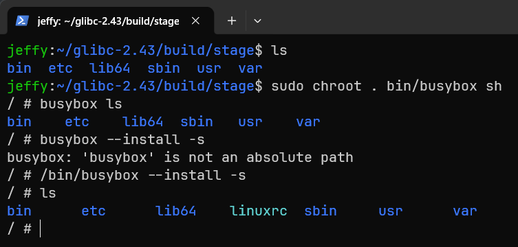

#### 动态链接程序依赖什么

这里需要稍微停一下。前面我们手写的`init`是静态链接程序，所以只要内核能解析它的ELF文件，它就可以直接运行。而这里的 BusyBox 是借助当前 Debian 环境构建出来的，默认会动态链接宿主工具链所使用的 C 库；在本文的环境里，它对应的是 glibc。因此它能否启动，不只取决于`/bin/busybox`本身是否存在，还取决于动态链接器和动态库是否在正确的位置。

可以先用`readelf`观察busybox记录的动态链接器路径。

```bash
readelf -l bin/busybox | grep interpreter
```

`readelf`输出里的`interpreter`就是动态链接器，x86_64 glibc系统里通常是`/lib64/ld-linux-x86-64.so.2`。内核加载动态链接程序时，并不会自己去解析所有`.so`文件，而是先根据ELF文件里的解释器路径启动动态链接器，再由动态链接器加载`libc.so.6`等共享库。

假设`readelf`输出的是`/lib64/ld-linux-x86-64.so.2`，就可以用下面的命令列出`/bin/busybox`在stage环境里实际解析到的共享库路径。

```bash
sudo chroot . /lib64/ld-linux-x86-64.so.2 --list /bin/busybox
```

这条命令直接在chroot里执行动态链接器，不依赖这个临时系统里已经存在`bash`或`sh`。如果`readelf`输出的interpreter路径不是`/lib64/ld-linux-x86-64.so.2`，则应以`readelf`的结果为准替换命令中的路径。打包initramfs前，要确保stage目录中同时包含busybox、动态链接器和它依赖的共享库。

自此，我们就拥有了一个真正可以使用的小型Linux环境了，可以将它安装在新的内核中试试效果。

```bash
find . -print0 | cpio -H newc -0 -o --owner=0:0 > ../../../minilinux.cpio
cd ~/linux-7.0.8
qemu-system-x86_64 -initrd ../minilinux.cpio -kernel arch/x86/boot/bzImage -append  "console=ttyS0"  -nographic
```

这里的`--owner=0:0`用于把归档中文件的所有者固定为root，Debian中的GNU cpio支持该参数。

这时你可能会发现：怎么反复重启了呢？

如果通过增加 `-no-reboot`检查，会发现内核最后打印了如下信息。

```
Memory: 12512K/130552K available (3629K kernel code, 767K rwdata, 308K rodata, 544K init, 220K bss, 117344K reserved, 0K )
clocksource: jiffies: mask: 0xffffffff max_cycles: 0xffffffff, max_idle_ns: 7645041785100000 ns
clocksource: Switched to clocksource tsc-early
platform rtc_cmos: registered platform RTC device (no PNP device found)
workingset: timestamp_bits=62 max_order=12 bucket_order=0
Unpacking initramfs...
Initramfs unpacking failed: invalid magic at start of compressed archive
```

如果真的按照内核给出的日志来检测是不是生成的cpio有问题，很容易陷入死胡同：在本文这个环境里，生成cpio的命令和文件本身都没有问题。本文这里直接提供答案，跳过定位过程，之后有时间再写。

在本文环境里，这是因为qemu默认分配的内存只有128MB，而我们生成的cpio有足足109M，加上内核占用后几乎没有剩余内存，内核在解包cpio时由于内存不足触发CPU reset，导致虚拟机整机重启。解决方案很简单，增加qemu的内存即可。使用`-m 1G`将内存增加到1G。

> [!note]
>
> 这里不是内核panic后的自动重启。未配置`panic=`等自动重启策略时，panic通常会停在原地。通过QEMU的异常日志确认，本文这次是triple fault触发了CPU reset。具体路径是：内存不足首先触发缺页异常(#PF)，异常处理过程中又触发了通用保护异常(#GP)，于是CPU转入double fault(#DF)；在投递#DF时再次触发#GP，最终形成triple fault。CPU无法继续处理triple fault，只能复位，所以看到的现象就是虚拟机反复重启。

使用下面的命令重新启动qemu，此时就可以进入系统了。

```bash
qemu-system-x86_64 -m 1G -initrd ../minilinux.cpio -kernel arch/x86/boot/bzImage -append  "console=ttyS0"  -nographic -no-reboot
```


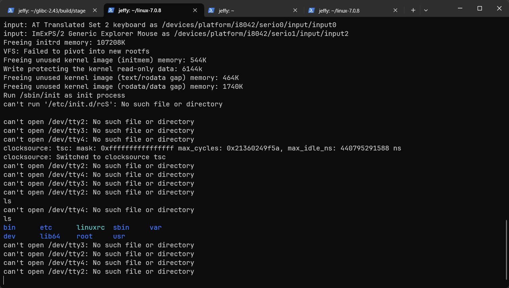

### 处理缺失的tty

重新启动后，你会看到屏幕循环打印`can't open /dev/tty2`这样的信息，这是因为`busybox`的`init`程序默认会尝试在`tty2, tty3, tty4`上都启用`getty`，但新构建的系统中并没有这些串口设备。一个简单的解决方案是修改配置文件，调整`init`的行为。

```bash
cd ~/glibc-2.43/build/stage/
mkdir -p etc
cat > etc/inittab <<'EOF'
::askfirst:-/bin/sh
::ctrlaltdel:/sbin/reboot
::shutdown:/bin/umount -a -r
EOF

find . -print0 | cpio -H newc -0 -o --owner=0:0 > ../../../minilinux.cpio
cd ~/linux-7.0.8
qemu-system-x86_64 -m 1G -initrd ../minilinux.cpio -kernel arch/x86/boot/bzImage -append  "console=ttyS0"  -nographic
```

这时，一个最小可用的Linux系统就跑起来了。你可以用`ls`查看文件，用`vi`编辑文本，用`sh`执行基础的脚本。

### 伪文件系统

在普通的Linux系统下使用`mount`查看文件系统，会发现目录下已经挂载了大量设备。使用`ps -ef`查看进程，也能看到不少进程。然而在我们的新系统中，你会发现这些功能都不能用。

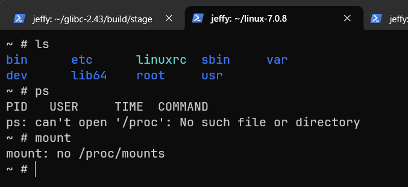

与其他操作系统不同，Linux奉行一切皆文件的法则，很多看起来需要特定接口才能实现的功能，在Linux中都被抽象为了文件操作，这其中包括查看进程信息、配置操作系统、内核调试、创建共享内存甚至直接操作硬件。这些操作大多是通过伪文件系统实现的。

顾名思义，**伪文件系统**就是长得像文件系统，但不是文件系统的东西。真实的文件系统要有存储设备和驱动并从该设备中获取目录树，然而伪文件系统则由内核直接提供目录树，无需外部设备参与。在Linux上，最核心的文件系统是下面几个。

- `devtmpfs`：用于暴露内核管理的设备节点，终端、硬盘、网卡等设备通常都需要通过`/dev`下的节点访问。
- `proc`：用于暴露进程信息和一部分内核运行时状态，`ps`、`top`等命令会依赖它读取进程列表。
- `sysfs`：用于暴露内核设备模型、驱动、总线和内核对象，很多设备发现和配置工作都会依赖`/sys`。

```
devtmpfs
-> Device Drivers
  -> Generic Driver Options
    -> Maintain a devtmpfs filesystem to mount at /dev (DEVTMPFS [=y])
proc/sysfs
-> File systems
  -> Pseudo filesystems
    -> /proc file system support (PROC_FS [=y])
    -> sysfs file system support (SYSFS [=y])
```

启用这几个选项后，内核就为我们提供了最核心的伪文件系统支持。

### 编写初始化脚本

不过在Linux世界中，内核为我们做的事情真的很少。看似一开机就会出现的根目录下的几个伪文件系统(`/dev, /proc, /sys`)并非是内核挂载的，而是用户态程序创建的。在这个从零开始搭建的Linux中，我们必须自己完成挂载。

我们要再一次编辑 `/etc/inittab`，写入我们要执行的初始化脚本。

```bash
cd ~/glibc-2.43/build/stage/
mkdir -p etc
cat > etc/inittab <<'EOF'
::sysinit:/etc/init.d/rcS
::askfirst:-/bin/sh
::ctrlaltdel:/sbin/reboot
::shutdown:/bin/umount -a -r
EOF

mkdir -p etc/init.d

# 编写fstab
cat > etc/fstab <<'EOF'
# 设备名  挂载点    设备类型   挂载属性           dump备份 fsck顺序  
proc      /proc     proc      nosuid,noexec,nodev   0 0
sysfs     /sys      sysfs     nosuid,noexec,nodev    0 0
devpts    /dev/pts  devpts    mode=0755,nosuid    0 0
tmpfs     /run      tmpfs     mode=0755,nosuid,nodev    0 0
EOF

#编写初始化脚本
cat > etc/init.d/rcS <<'EOF'
#!/bin/sh
mkdir -p /dev /sys /proc /run 
mount -t devtmpfs devtmpfs /dev
mkdir -p /dev/pts
mount -a
EOF
chmod +x etc/init.d/rcS

# 重新启动操作系统
find . -print0 | cpio -H newc -0 -o --owner=0:0 > ../../../minilinux.cpio
cd ~/linux-7.0.8
qemu-system-x86_64 -m 1G -initrd ../minilinux.cpio -kernel arch/x86/boot/bzImage -append  "console=ttyS0"  -nographic
```

此时，我们的大多数功能就OK了。

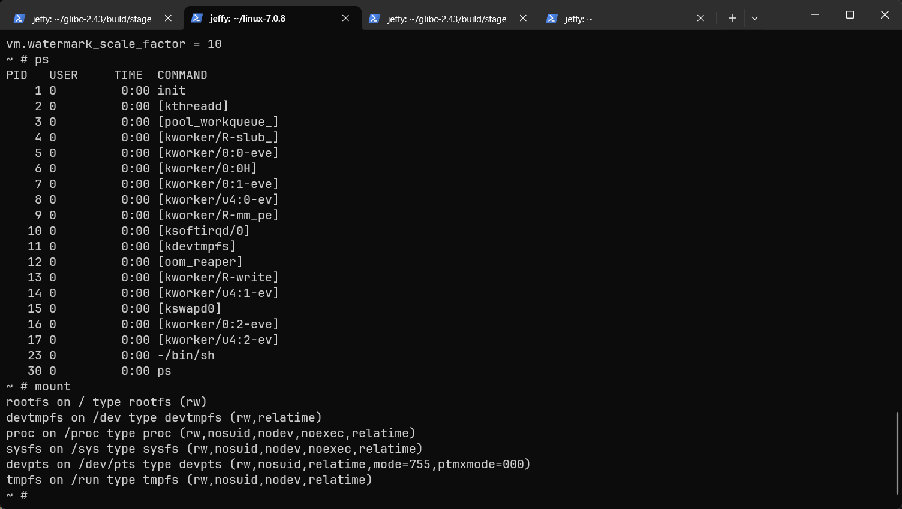

### 网络支持

现在我们只有一个单机的Linux，为了让这个Linux能真正可用，我们需要为设备添加网络能力。

首先在首页中启用`Networking support`，并参考下方配置配置好协议栈支持。

```
General setup
  [*] Configure standard kernel features (expert users)  --->
    
 
[*] Networking support  --->
      Networking options  --->
        [*] Packet socket
        [*] Unix domain sockets
        [*] TCP/IP networking
        
-> Device Drivers
  [*] PCI support  --->
  [*] Virtio drivers  --->  # 要先启动它
  	[*]   PCI driver for virtio devices
  [*] Network device support  --->
  	[*]   Network core driver support
  	  [*]     Virtio network driver
```

```bash
make -j$(nproc)
qemu-system-x86_64 -m 1G \
	-initrd ../minilinux.cpio \
	-kernel arch/x86/boot/bzImage \
	-append  "console=ttyS0" \
	-nographic \
	-netdev user,id=net0 \
	-device virtio-net-pci,netdev=net0
```

进入系统后，确认 BusyBox 配置中已经启用了`ip`、`udhcpc`和`wget`这些applet。QEMU的user网络默认会提供一个虚拟DHCP服务，常见网关地址是`10.0.2.2`，客户机地址通常会分配到`10.0.2.15`。

```bash
ip link set lo up
ip link set eth0 up
udhcpc -i eth0
# udhcpc: started, v1.38.0
# udhcpc: broadcasting discover
# udhcpc: broadcasting select for 10.0.2.15, server 10.0.2.2
# udhcpc: lease of 10.0.2.15 obtained from 10.0.2.2, lease time 86400

ip addr flush dev eth0
ip addr add 10.0.2.15/24 dev eth0

ip route del default 2>/dev/null
ip route add default via 10.0.2.2 dev eth0
echo "nameserver 1.1.1.1" > /etc/resolv.conf
```

上面的`udhcpc`用于从QEMU的DHCP服务获取网络参数；由于我们还没有准备完整的DHCP脚本，这里我们选择手动配置IP、默认路由和DNS。DNS这里直接指定1.1.1.1，读者也可自行指定。最后使用`wget`命令来测试一下效果。运行下面的命令后，应该能打印出实际的网络访问情况。

> [!tip]
>
> 公网DNS IP参考：阿里云：223.5.5.5；114DNS：114.114.114.114；Google：8.8.8.8


```bash
wget https://www.baidu.com  -qO-
```

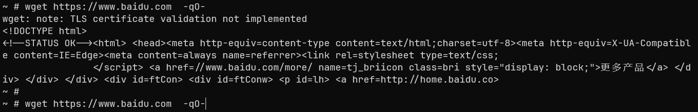

## 制作硬盘镜像

`initramfs`是工作在内存中的文件系统，实际使用时，自然不可能只靠内存来工作。相信读者也已发现，在之前的所有操作中，在新系统修改文件无法持久保存。本节先添加一块虚拟硬盘，把它作为数据盘挂载到系统中，用来验证文件持久化。至于把根文件系统整体迁移到硬盘，则留到下一节。

### 配置驱动

首先配置内核，让内核支持虚拟块设备与ext4文件系统。

> [!tip]
>
> 一些较新的Linux发行版会使用btrfs文件系统，但本教程只是验证块设备和文件持久化，btrfs并不会带来明显优势，配置项和排错复杂度反而更高。因此这里选择更常见、更简单的ext4。

```
[*] Enable the block layer  --->

File systems  --->
	[*] The Extended 4 (ext4) filesystem
Device Drivers  --->
	[*] PCI support  --->
	[*] Virtio drivers  --->
		[*]   PCI driver for virtio devices
	[*] Block devices  --->
		[*]   Virtio block driver
```

如果前面已经完成过网络配置，PCI与Virtio PCI驱动通常已经启用；如果跳过了网络章节，这里需要一并确认。

### 创建并使用虚拟硬盘

使用`qemu-img`创建一个虚拟硬盘文件。`qemu-img`通常来自`qemu-utils`，`mkfs.ext4`通常来自`e2fsprogs`；如果命令不存在，可以先安装依赖。

```bash
sudo apt install qemu-utils e2fsprogs -y
# 创建一个1G的虚拟硬盘
qemu-img create -f raw disk.img 1G
# 格式化为ext4文件系统
mkfs.ext4 disk.img
```

可以使用`file disk.img`查看虚拟硬盘是否成功格式化。

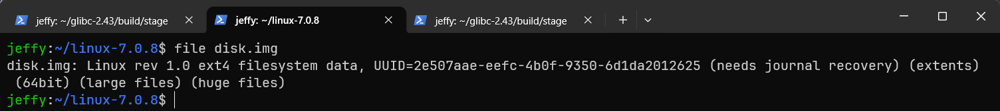

使用下面的命令运行qemu模拟器。

```bash
qemu-system-x86_64 -m 1G \
    -initrd ../minilinux.cpio \
    -kernel arch/x86/boot/bzImage \
    -append  "console=ttyS0 rdinit=/sbin/init" \
    -nographic \
    -netdev user,id=net0 \
    -device virtio-net-pci,netdev=net0 \
    -drive file=disk.img,format=raw,if=virtio
```

简单解释一下新增的部分。

- `-append`内的`rdinit=/sbin/init`，用于明确指定initramfs中的第一个用户态进程。这里的硬盘只作为后续手动挂载的数据盘使用，根文件系统仍然来自initramfs。
- `-drive file=disk.img,format=raw,if=virtio` 使用disk.img作为硬盘文件，格式为纯硬盘内容，使用virtio接口暴露给虚拟机。

```bash
mkdir /mnt 
mount -t ext4 /dev/vda /mnt
echo "Hello, ram file!" > /ramFile.txt
echo "Hello, disk file!" > /mnt/diskFile.txt
```

使用`reboot`重启设备。

> [!warning]
>
> 不要使用Ctrl+A, X 直接终止虚拟机，刚写入的文件大概率还在页缓存中没有落盘，直接终止虚拟机，写入的数据可能丢失或损坏。如果想通过这种方式关机重启，可以先通过`umount /mnt`拆卸挂载，让内核将页缓存写回硬盘。

```bash
mkdir /mnt
mount -t ext4 /dev/vda /mnt
cat /ramFile.txt   # 报错，因为内存中的文件已经没有了
cat /mnt/diskFile.txt
```

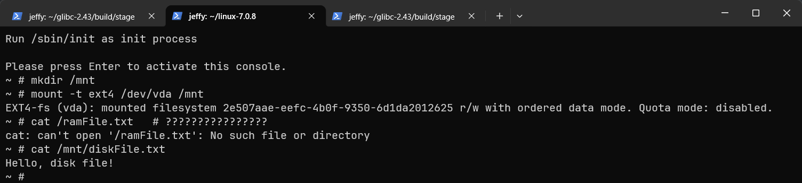

## 将内核迁移至硬盘

现在我们有了一个持久化的硬盘，接下来要做的就是将内核与用户态程序都迁移到硬盘中，实现从硬盘中启动设备。目前，我们用qemu的`-kernel`参数直接指定了要启动的内核，接下来，我们要通过x86约定从磁盘中直接启动内核。

计算机术语中，boot一词来源于bootstrap，取自短语“Pull oneself over a fence by one’s bootstraps.”即“靠拽自己鞋带把自己拽起来翻过围栏”。程序需要环境来运行，环境需要程序来配置，而系统启动，则是完成这个自举过程的第一步：先用极少的代码建立最小运行环境，再一步步加载更复杂的程序。

> [!note]
>
> X86启动约定和本文理解Linux的主旨关系不大，但作为完整启动的一环不得不简单看一下。有些地方不会写得太详细，旨在不求甚解；但仍会在关键点留下一两句解释，以便读者自行查阅资料或询问AI。

### BIOS与EFI

在qemu中，默认是使用BIOS启动设备的。在现代设备中，默认的启动方式已经换成了UEFI。我们会分别看两种启动方式，并简要说明为什么UEFI成为了新设备的启动范式。

BIOS的启动方式非常简单：读取启动扇区，运行启动扇区中的引导代码，引导代码再加载操作系统，并最终把控制权交给操作系统。而这段引导代码通常就是bootloader。在这里我们会手搓一个简易的bootloader，并通过它看到完整的Linux启动过程。BIOS通常会和MBR分区表一起出现，所以我们先向创建的磁盘写入一个MBR分区表。

> [!note]
>
> 编写X86的bootloader其实很烦人，由于X86历史包袱重，CPU同时存在16位实模式、32位平坦模式、32位保护模式和64位长模式。而历史包袱少的ARM64，则一上电就是64位模式。bootloader要工作在16位实模式中，写C语言都不好写。

### 重新格式化硬盘

我们为磁盘写入MBR分区表，并创建两个分区：一个FAT32分区用于存放Linux内核与initramfs，另一个ext4分区用于存放实际的数据文件。后面编写bootloader时，我们会让它具备读取基础FAT32目录和文件内容的能力；这里先把分区布局准备好。

```bash
# 安装分区/文件系统工具
sudo apt install parted dosfstools e2fsprogs
# 清掉旧签名/分区表
wipefs --force -a disk.img
# 创建 MBR 分区表
parted disk.img --script \
  mklabel msdos \
  mkpart primary fat32 1MiB 257MiB \
  mkpart primary ext4 257MiB 100% \
  set 1 boot on
LOOP=$(sudo losetup -Pf --show disk.img)
echo $LOOP
sudo mkfs.fat -F 32 "${LOOP}p1"
sudo mkfs.ext4 "${LOOP}p2"
mkdir boot_partition
sudo mount -t vfat "${LOOP}p1" boot_partition
sudo cp arch/x86/boot/bzImage boot_partition/vmlinuz
sudo umount boot_partition
rm -rf boot_partition
sudo losetup -d "${LOOP}"

```

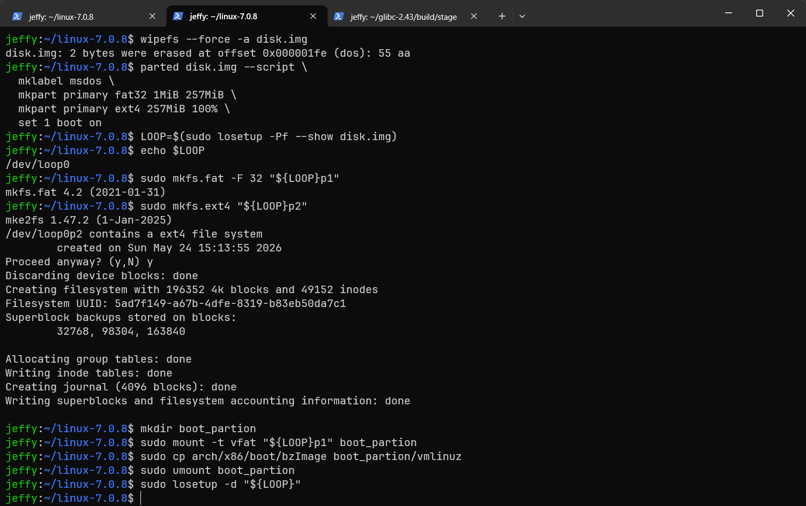

现在磁盘已经格式化好，我们先去编写一个最简单的bootloader。

### 编写bootloader

我这个人不太喜欢写纯汇编，宁可内联一大坨也不想写纯汇编。所以这次的bootloader还是用C写。我们先写一个最简单的打印字符的bootloader，看看该怎么写。在Linux的目录下直接创建一个`boot.c`。

```C [boot.c]
/*
    * BIOS teletype output:
    * AH = 0x0e
    * AL = character
*/
#define putchar(c) do {                                \
    unsigned short ax = 0x0e00 | ((unsigned char)(c)); \
    unsigned short bx = 0x0000;                        \
    __asm__ volatile (                                 \
        "int $0x10"                                    \
        : "+a"(ax), "+b"(bx)                           \
        :                                              \
        : "memory"                                     \
    );                                                 \
} while (0)

__attribute__((noreturn))
void boot_main() {
    for (char x = 'a'; x <= 'z'; x++) {
        putchar(x);
    }
    putchar('\r');
    putchar('\n');
    for (char x = 'A'; x <= 'Z'; x++) {
        putchar(x);
    }
    putchar('\r');
    putchar('\n');
    for (char x = '0'; x <= '9'; x++) {
        putchar(x);
    }
    putchar('\r');
    putchar('\n');
    while(1) {
        __asm__ volatile ("hlt");
    }
}
__asm__ (
".code16gcc\n"
".global _start\n"
"_start:"
    "cli\n\t" // 关中断
    "xor %ax, %ax\n\t"
    // 清空基址寄存器们
    "mov %ax, %ds\n\t"
    "mov %ax, %es\n\t"
    "mov %ax, %fs\n\t"
    "mov %ax, %gs\n\t"
    "sti\n\t" // 开中断
    "call boot_main\n\t"
);
```

使用下面的命令编译为一个纯二进制文件。

```bash
gcc -m16 -march=i386 \
    -fno-pie \
    -fno-pic \
    -fno-builtin \
    -fno-unwind-tables \
    -fno-asynchronous-unwind-tables \
    -nostdlib \
    -Ttext=0x7c00 \
    -Os \
    -Wl,-e,_start \
    -Wl,--oformat=binary \
    boot.c -o boot.bin

# 确保这个文件要小于512字节
ls -l boot.bin
# 如果超过510字节，不能直接截断，需要先缩小代码体积
test $(stat -c%s boot.bin) -le 510
# 不足510字节时补零到 510 字节
truncate -s 510 boot.bin
# 写入 BIOS boot sector 签名 0x55 0xaa
printf '\x55\xaa' >> boot.bin
```

> [!note]
>
> bootloader运行在16位设备中，所以要加`-m16`编译选项。我们希望编译产物尽可能小，所以加入`-Os`优化选项。
>
> 默认情况下，链接器会输出ELF文件，这里使用`--oformat=binary`让其输出原始二进制。
>
> BIOS会默认将代码段加载到0x7c00，需要在编译时显式指定代码将会被放在这里。
>
> 和上面的使用原始系统调用一样，一切由库提供的功能都不能使用。并且千万别搞位置无关，这里位置相关，一定要加`-fno-pic -fno-pie`。
>
> 使用GCC生成16位boot sector本身是偏实验性的写法，后续代码变复杂后尤其要关注生成的指令、段布局和最终大小。严肃的bootloader通常会使用汇编，或至少配合更完整的linker script控制布局。
>
> 纯C文件做精细控制真的不好做，实际的bootloader将会采用 C + 汇编+链接器脚本的方式。

开机试一下。

```bash
qemu-system-x86_64 -drive file=boot.bin,format=raw
```


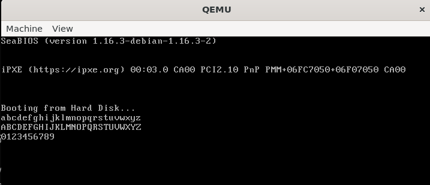

### 从镜像引导Linux

### 移除initramfs

