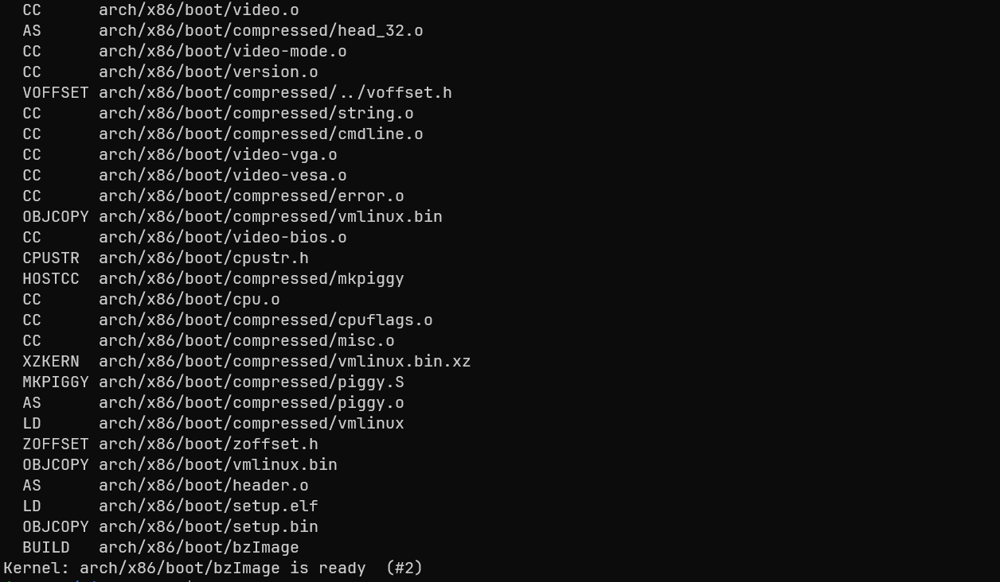
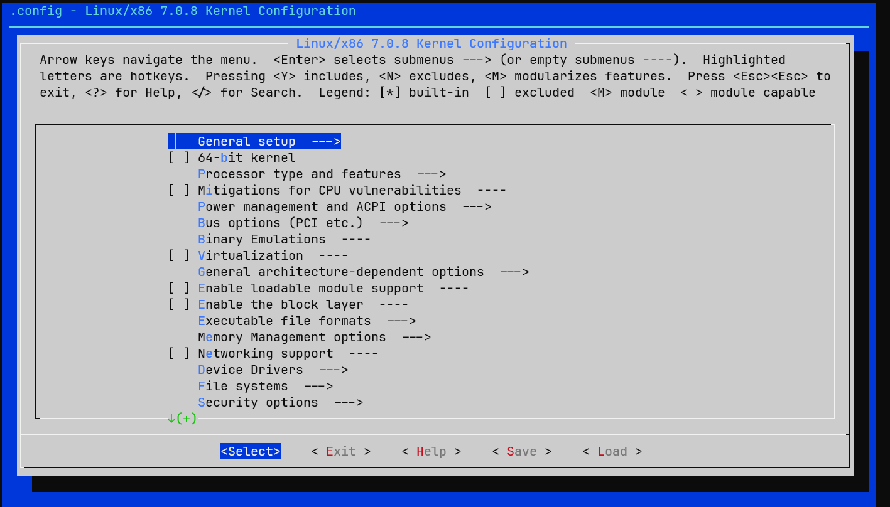
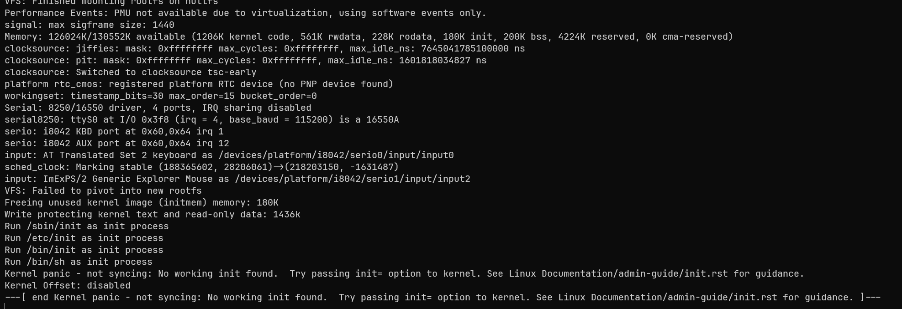
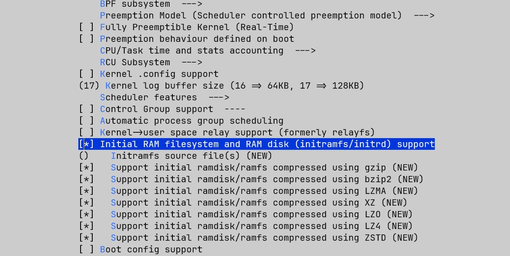

# 从源码构建Linux内核

本文基于WSL2，Debian13发行版。

## 环境准备

### WSL配置

请确保您使用了Windows11或Windows10的较高版本，以保证对WSL2有完善的支持。

```powershell
wsl --install Debian
```

在本文编写时（2026-05-17），该命令会下载Debian 13版本。若很久后Debian出更高版本，理论上不会对本文内容造成影响。

#### 清理PATH环境变量

默认的WSL会继承Windows的PATH环境变量，这本意是让用户在WSL环境下也可以轻松执行Windows内的命令行工具，但也会影响路径搜索，为避免该问题，需要禁止WSL继承Windows PATH。

使用任意文本编辑器编辑`/etc/wsl.conf`，在下方追加：

```
[interop]
appendWindowsPath = false
```

追加后，回到Windows环境，使用`wsl --shutdown`关闭当前Linux，重新进入。

#### Debian换源

对于国内Linux用户，访问Debian官方源可能会很慢，推荐使用[清华源](https://mirrors.tuna.tsinghua.edu.cn/help/debian/)。换源方法在此不过多赘述，但需要注意的是，Debian13使用了新的DEB822格式，若使用传统方式（即编辑`/etc/apt/sources.list`）换源，需要再执行以下命令，避免原有的Debian源卡住`apt update`。

```bash
mv /etc/apt/sources.list.d/0000debian.sources \
/etc/apt/sources.list.d/0000debian.sources.bak
```

## 源码下载

可以去内核归档网站([kernel.org](https://kernel.org)) 下载内核源代码，我这里用的是7.0.8最新的稳定版内核，当然也可以选择其他版本的内核。进入网站后，点击下载你想要版本的tarball即可。

> **注意**：通常，在Windows的终端中输入`wsl`会进入当前所在的Windows目录，**强烈不建议**在该目录内进行内核编译等操作，这会严重拖慢编译速度。

下载后，将内核的tar文件复制到Linux的用户目录下。

```bash
sudo apt install xz-utils -y
tar -xf linux-7.0.8.tar.xz
cd linux-7.0.8
```

解压完Linux后，我们需要准备编译必备的环境。

# 构建并执行第一个Linux内核

## 环境准备

Linux内核也是在Linux上完成编译的，编译Linux内核需要许多工具，本文仅会安装编译Linux所需的最少工具。

工具列表：

- `make & gcc` 核心构建工具，包括构建脚本解释器、C语言编译器及二进制文件操作工具。
- `flex & bison` 用于配置时期的代码生成
- `bc` 高精度计算器
- `ncurses-devel` 使用`make menuconfig`需要的图形库
- `libelf-dev` elf头文件支持

执行下面脚本安装必要依赖。

```bash
sudo apt install make gcc \
	flex bison bc libelf-dev \
	libncurses-dev -y
```

安装好环境，就可以开始内核配置了。

## 内核配置

使用`make tinyconfig`执行最小配置，这将会产生一个可以编译出最小可执行内核的配置。


执行后，配置文件将会写入`.config`文件，可以使用`less .config`查看配置，可以看到，以`#`开头的是注释，有大量选项被配置为y。这里我们不过多纠结具体内容，只需要了解大体格式即可。

拥有`.config`文件后，就可以执行`make -j$(nproc)`来进行内核的编译了，稍微等待几分钟就会编译完成，此时我们就有了一个最小可运行的Linux内核了。不过现在的内核由于缺少一些驱动，还不能实际使用。

编译出的内核文件有多个，在当前目录下有一个vmlinux，这是以ELF格式存放的Linux内核镜像，但我们实际使用的是存放于`arch/x86/boot/bzImage`中压缩后的Linux内核镜像。




## 运行内核

运行内核需要一个虚拟机，而Linux上调试内核最常见的虚拟机则是qemu，使用apt安装qemu-system，这可以让qemu模拟一台上古时期的x86电脑。

```bash
sudo apt install qemu-system
```

安装需要一点时间，安装完成后，就可以使用qemu模拟器执行你的第一个Linux内核了。

```bash
qemu-system-x86_64 -kernel arch/x86/boot/bzImage -nographic
```

这里的`-kernel`指定了内核镜像，而`-nographic`则让qemu启动一个没有图形界面的电脑，我们现在还不需要图形界面。

运行后你会看到黑乎乎的一片，什么都没有，这就代表基础内核已经成功加载了，但是由于没有驱动，它无法与我们交互。同样它也无法真正执行关机，所以只有一片黑乎乎在这里卡着。

> 按下Ctrl + A后，按X退出QEMU，推荐退出后再使用命令`reset`重置一下窗口内容，否则多行文本渲染可能有bug。

### 回忆一下计算机体系结构

如今我们的主流芯片都是冯诺依曼结构，它由五个部分：运算器、控制器、存储器、输入设备和输出设备组成。在这个最简Linux内核中，只有运算器、控制器和存储器（即CPU和内存），没有输入输出设备，无法与用户交互，只能执行确定性的过程。

# 逐步构建一个真正可用的内核

## 启用内核日志

在最初的内核里，我们什么也看不到，但我们希望至少内核可以告诉我们发生了什么，否则一片漆黑中，根本无法继续探索。

使用`make menuconfig`来进入图形化的Linux配置界面。




我们要启用几个关键选项：printk支持、TTY支持、串口驱动。

启用printk后，我们就可以看到内核的日志打印，这至少能让我们知道此时发生什么了。

`General setup`  --->

- `[ * ] Configure standard kernel features (expert users)` --->
  - `[ * ] Enable support for printk` 

​                     

启用TTY支持，让内核的printk输出到TTY终端，我们会在qemu的输出中看到内核的日志。

`Device Drivers` --->

- `Character devices` --->

  - `[ * ] Enable TTY` 

- `Serial drivers` --->

  - `[ * ] 8250/16550 and compatible serial support`
  - `[ * ] Console on 8250/16550 and compatible serial port` 


重新编译，然后使用下面的命令执行内核。

```bash
qemu-system-x86_64 -kernel arch/x86/boot/bzImage -append "console=ttyS0" -nographic
```

这里的`-append`是内核的启动参数，通过使用该参数，内核将信息输出到console，而console的内容被导向ttyS0，而qemu中，ttyS0会被打印到标准输出中，此时就可以看到启动日志了。

> `tty`：代表 Teletypewriter（电传打字机）。在计算机早期，人们使用电传打字机作为输入输出设备。虽然现在技术早就更新换代了，但 Linux 依然沿用了 `tty` 这个词来表示所有的**终端设备**。
>
> `S`：代表 **Serial**（串行）。这意味着它是一个串行通信接口。
>
> `0`：代表**编号**。在计算机世界里，计数通常从 0 开始。所以 `ttyS0` 是第一个串口（COM1），`ttyS1` 是第二个串口（COM2），以此类推。



可以看到，这次内核成功打印出了信息，在最后发生了内核恐慌：内核要找到一个初始化进程作为用户态的第一个进程（PID 1），它尝试寻找了`/sbin/init`，`/etc/init`，`/bin/init`，直到`/bin/sh`，都没有找到可运行的进程，不得已内核只能恐慌退出。


## 编写自己的init进程

Linux内核在启动完成后，就会启动系统中的第一个用户态进程，为PID1，是所有其他用户态进程的祖先。作为所有进程的祖先，它有几个特殊点。

1. 它总是以root身份启动（但容器中的PID1并非如此）。
2. 任何孤儿进程都会变为PID1的子进程。
3. 一旦PID1崩溃或退出，内核会立刻陷入恐慌，无法继续工作。

如今，几乎所有发行版都会使用`systemd`作为`init`进程，不过作为教程，本文会从头编写一个最简单的初始化进程。

不过在正式编写前，我们需要解决一些问题，以让我们的程序可以在自己的内核里正常工作。

### 架构匹配：64位内核

在进入用户态之前，我们必须确保内核的位宽与我们即将编写的程序架构相匹配。默认情况下，编译器会编译出本平台的程序，在WSL2下，通常就是x86_64架构的程序。

`[*] 64-bit kernel`

由于我们运行在现代的 x86_64 平台上，我们需要在内核选项里开启它。它决定了内核将运行在 64 位长模式（Long Mode）下，能够寻址超过 4GB 的内存，并使用 64 位的通用寄存器。如果关闭它，内核将编译为 32 位（i386）内核。

### 运行核心：ELF支持

Linux 下绝大多数可执行程序、动态链接库和核心转储文件都是 **ELF（Executable and Linkable Format）** 格式。内核必须懂得如何解析这种格式，才能将编译好的程序加载到内存中执行。在最小配置下，内核并没有配置ELF的解析能力，需要我们手动配置。

 `Executable file formats` --->  

- `[*] Kernel support for ELF binaries` 

如果缺少 ELF 支持，内核在尝试启动用户态程序时，会因为“无法识别的文件格式”而直接抛出 Exec format error。由于1号进程也无法执行，这会引起内核恐慌退出。

> 虽然ELF是Linux世界的标准格式，但是Linux内核并不必须要求能解析ELF文件，也存在一些比ELF更简单的文件格式。

### 动态链接与静态链接

在编写我们自己的 `init` 进程前，必须理解程序是如何运行的： 

* **动态链接（Dynamic Linking）**：程序在编译时并不包含库（如 glibc）的代码，而是在运行时依赖系统中的 `.so` 动态链接库。这种方式能节省磁盘和内存，但要求系统里必须有一套完整的动态链接加载器和基础库。
*  **静态链接（Static Linking）**：编译时把所有需要的库函数直接“打包”进最终的二进制文件中。生成的程序体积极大，但**不依赖任何外部环境**，放到任何相同架构的裸机上都能直接运行。

由于我们现在这台设备上除了内核，什么库都没有，所以必须使用静态链接的方式编译，否则会因为缺少动态库与装载器而无法运行。

现在，我们创建一个目录`_root`，在其中新建一个`init.c`，写入如下内容。

```C
#include <stdbool.h>
#include <unistd.h>
#include <string.h>
#include <stdio.h>

int main() {
    printf("init process stared\n");
    while (true) {
        char buf[256] = {0};
        if (fgets(buf, sizeof(buf), stdin) == NULL) {
            printf("read error");
            return 1;
        }
        if (strcmp(buf, "exit\n") == 0) {
            return 2;
        }
        printf("You typed: %s", buf);
    }
}
```

使用如下命令编译。

```bash
gcc init.c -static -o init
```

其中，`-static`指的就是静态编译。可以使用`ldd`命令查看一个程序是否是静态链接程序。

```bash
jeffy:~/linux-7.0.8/_root$ ldd init
        not a dynamic executable
```

也可以使用`chroot`命令切换根，看看该程序是否可以在无库无加载器的情况下执行。

> **注意**：`chroot`命令需要特权才能执行。

```bash
jeffy:~/linux-7.0.8/_root$ sudo chroot . /init
init process stared
aaa
You typed: aaa
bbb
You typed: bbb
exit
jeffy:~/linux-7.0.8/_root$
```


### initramfs与cpio

现在我们的精简内核没有任何文件，即使编译出了自己的`init`进程，也无法塞到内核里，所以，我们需要启动Linux内核的`initramfs`功能。`initramfs`通过内核的`tmpfs`机制为我们提供了一个在内存中的文件系统，无需提供实际的磁盘镜像。

`General setup`  --->

- `[ * ] Initial RAM filesystem and RAM disk (initramfs/initrd) support` 



在更新配置，重新编译内核后，我们要将我们的`init`文件打包为内核可识别的cpio文件格式。

```bash
cd _root
find | cpio -H newc -o > ../root.cpio
```

使用以下命令重新启动新编译的Linux内核。

```bash
qemu-system-x86_64 -initrd root.cpio -kernel arch/x86/boot/bzImage -append "console=ttyS0" -nographic
```

`-initrd`为qemu的选项，该选项会将文件填入特定位置，Linux内核将会从该位置读取文件，初始化tmpfs。


可以看到，当输入其他字符时，该程序会回显，而当输入exit时，程序会退出，而由于1号程序的退出，内核陷入恐慌退出。

### 原始系统调用与X86_64汇编

如果我们看我们自己写的`init`程序，会发现非常简单的一个功能，却占用了几百K的空间，这几百K的空间是静态链接的C库带来的，它为我们提供了C语言的大量功能，比如我们看到的`printf`、`fgets`、`strcmp`，以及对主函数返回值到退出码的支持。通过C库提供的这些包装，我们可以更轻松的和操作系统打交道。同时，C库也帮我们提供了屏蔽操作系统差异的接口，让我们可以把一套C语言程序移植到其他操作系统中。

然而在我们这个简易的init程序中，携带这么多代码就显得无用了，所以我们可以使用原始系统调用，避免对C库的依赖，以简化我们的可执行文件。

移除C库依赖的开始，我们需要移除对函数的依赖，`fgets`和`printf`显然不能再使用了，`strcmp`也不能直接用了，所以需要替换掉它们。

对于`strcmp`，我们可以轻松使用C语言自己实现。

```C
int strcmp(const char *s1, const char *s2) {
	while (*s1 && (*s1 == *s2)) {
		s1++;
		s2++;
	}
	return *(unsigned char *)s1 - *(unsigned char *)s2;
}
```

然而`printf`这样的函数涉及到向硬件输出，我们就不得不和操作系统打交道了。``printf`是C库提供的打印函数，但如果直接和内核打交道，`printf`就无法使用了。

要想直接和内核打交道，就必须要了解**系统调用**。我们可以把系统调用看做一种特殊的函数调用，只不过函数调用调用的是自己写的函数或库，但系统调用要使用操作系统的能力。由于内核工作在更高的特权级，程序只能通过特定的指令来进行系统调用。在X86_64设备上，它的汇编为`syscall`，不过作为对曾经设计的兼容，`int 80h`也是可用的指令。

C语言为了保持跨平台兼容性，并不会原生提供系统调用的关键字，而是使用C库包装，所以为了使用原始系统调用，我们需要一些汇编来编写系统调用的核心代码。不过C语言为我们提供了内联汇编的能力，我们可以使用内联汇编来完成核心的功能，剩下的周边功能可以继续使用C语言。


```C
#include <stdint.h>

#define STDIN 0
#define STDOUT 1

intptr_t syscall(intptr_t number, intptr_t arg1, intptr_t arg2, intptr_t arg3, intptr_t arg4, intptr_t arg5, intptr_t arg6) {
    intptr_t ret;
    register long r_num __asm__("rax") = number;
    register long r_a1  __asm__("rdi") = arg1;
    register long r_a2  __asm__("rsi") = arg2;
    register long r_a3  __asm__("rdx") = arg3;
    register long r_a4  __asm__("r10") = arg4;
    register long r_a5  __asm__("r8")  = arg5;
    register long r_a6  __asm__("r9")  = arg6;
	__asm__ volatile (
		"syscall\n\t"
		: "=a"(ret)
		: "r"(r_num), "r"(r_a1), "r"(r_a2), "r"(r_a3), "r"(r_a4), "r"(r_a5), "r"(r_a6)
		: "rcx", "r11", "memory"
	);
	return ret;
}

int strcmp(const char *s1, const char *s2) {
	while (*s1 && (*s1 == *s2)) {
		s1++;
		s2++;
	}
	return *(unsigned char *)s1 - *(unsigned char *)s2;
}

intptr_t read(int fd, void *buf, uintptr_t count) {
	return syscall(0, fd, (intptr_t)buf, count, 0, 0, 0);
}

intptr_t write(int fd, const void *buf, uintptr_t count) {
	return syscall(1, fd, (intptr_t)buf, count, 0, 0, 0);
}

[[noreturn]] void exit(int status) {
	(void)syscall(60, status, 0, 0, 0, 0, 0);
	__builtin_unreachable();
}

[[noreturn]] void start()
{

	write(STDOUT, "init process started\n", sizeof("init process started\n") - 1);
	while (1) {
		char buf[256] = { 0 };
		intptr_t readSize = read(STDIN, buf, sizeof(buf) - 1);
		if (readSize < 0) {
			write(STDOUT, "read error", sizeof("read error") - 1);
			exit(1);
		}
		if (strcmp(buf, "exit\n") == 0) {
			exit(2);
		}
		write(STDOUT, "You typed: ", sizeof("You typed: ") - 1);
		write(STDOUT, buf, readSize);
	}
}

__asm__(
".global _start\n"
"_start:\n\t"
	// 清空rbp
	"xorq %rbp, %rbp\n\t"
	// 16字节对齐rsp，避免SIMD指令引发的对齐SIGSEGV
	"andq $-16, %rsp\n\t"
	"movq %rsp, %rbp\n\t"
    "call start\n\t"
    "int $3\n"
);
```

使用以下命令编译，将会编译出一个仅有必要的核心内容的程序。它使用原始的系统调用直接完成功能，不带有额外的运行时开销。

```bash
gcc -fno-builtin -static -nostdlib -O2 init.c -o init
```

这样就可以编译出一个核心ELF，仅有9K，并且不再需要静态链接libc。


> 9K其实仍然有很多空位和可优化项，理论上可以把它优化到1K以内，不过本文主要讨论的点并非这里，所以此处略过。

## 构建glibc

在Linux中，有大量的程序都是动态链接的，我们必须要为这些程序提供它们运行的基石：C运行时库。由于C接口稳定，应用广泛，无论编程语言是什么，它们的产物几乎都会动态链接C库，用于简化语言自身库设计、提高运行性能，或者为语言本身提供支持。在这一节，我们需要构建Linux世界最核心的用户库：ld-linux 和 libc。

> 常见语言中，Golang是个例外：纯Go程序默认是静态链接的，不需要任何外部库的参与。

LibC作为C语言运行时库，它并非只有一种实现，比如GNU的glibc，Android的Bionic libc，为静态链接设计的musl libc，微软也在Windows中提供了自己的C运行时实现，在Windows中是 `msvcrt.dll`。而我们这次要构建的是Linux世界中最通用的`glibc`。

前往[The GNU C Library](https://www.gnu.org/software/libc/#download)下载GLibC的源码。通过这次构建，我们将会构建出C语言的核心库及头文件支持，为我们之后在自己的内核中编译文件打下基础。与Linux内核不同，glibc并不会非常频繁的更新，也没有大量可配置的编译选项。

> Debian 13自带的`gawk`工具可能较老，如果是这样，需要`sudo apt install gawk`更新一下。

```bash
cd glibc-2.43
# 创建构建目录，构建结果将会放在这里
mkdir build && cd $_
# 进行配置，由于我们要给自己的内核安装，所以prefix需要为根目录的 /usr
../configure --prefix=/usr
make -j$(nproc)
# 创建install目录
mkdir stage
# 构建，但不能真的把libc安装在/usr下，这会替换当前系统的libc，导致无法运行。
# 所以必须使用DESTDIR=$(realpath stage)指定一个用户目录
make install DESTDIR=$(realpath stage)
```

经过这次编译，我们已经在stage目录下产生了大量文件：包括标准的C库、数学计算库、加载器和头文件。这将是用户态Linux世界中最初的支柱。


### busybox：Linux世界的瑞士军刀

如果每一个 Linux 命令（如 `ls`, `cd`, `mkdir`, `sh`）都要我们手动去写，那工作量太恐怖了。好在开源世界有 **BusyBox**。 BusyBox 将几百个常用标准 Linux 命令的精简版全部打包到了**同一个可执行二进制文件**中。它会根据你调用它时的“名字”（通过创建软链接，比如把 `ls` 链接到 `busybox`），来决定执行什么功能。在构建嵌入式系统或像我们这种精简内核时，BusyBox 是不二之选，它能帮我们一键生成最基础的用户态环境。

#### 下载并构建busybox

前往[Busybox](https://busybox.net/)下载busybox源码。我下载的是1.38版本。busybox的配置需要`pkg config`，使用`sudo apt install pkg-config`

如果各位下载1.37版本的话，可能会出现`make menuconfig`失败的情况，需要修改`scripts/kconfig/lxdialog/check-lxdialog.sh`中的`check`函数，把`main() {}` 改为`int main() {return 0;}`。

> ```C
> main() {}
> int main() {return 0;}
> ```
> 这两种写法都是有效的C语言代码，在极早期的C语言设计（早于C89）中，函数声明可以不用写返回类型。但现代编译工具链会默认启用对这类早期写法的错误告警，导致无法进入`make menuconfig`

使用下面的代码对`busybox`应用默认配置。

```bash
make defconfig
```

由于busybox使用的文件较老，它编译`tc`命令会报错，所以我们要在`make menuconfig`中删除掉对`tc`的支持。

```bash
make menuconfig
	Networking Utilities  --->
		[ ] tc (8.3 kb)  # 要把这个去掉
```

接下来进行编译。

```bash
make -j$(nproc)
```

#### 创建初始化脚本


### 伪文件系统


#### relay与netlink


### 装载器：程序的基石


### 用户态的世界


## 制作可启动的磁盘镜像


### 第一个可运行的完整Linux


### 挂载


### 单根与多根


### 网络支持


### 复用包管理器


# 内核自举

